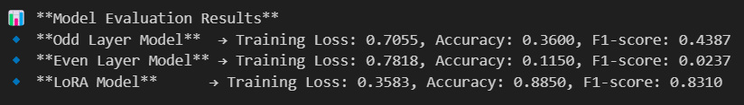
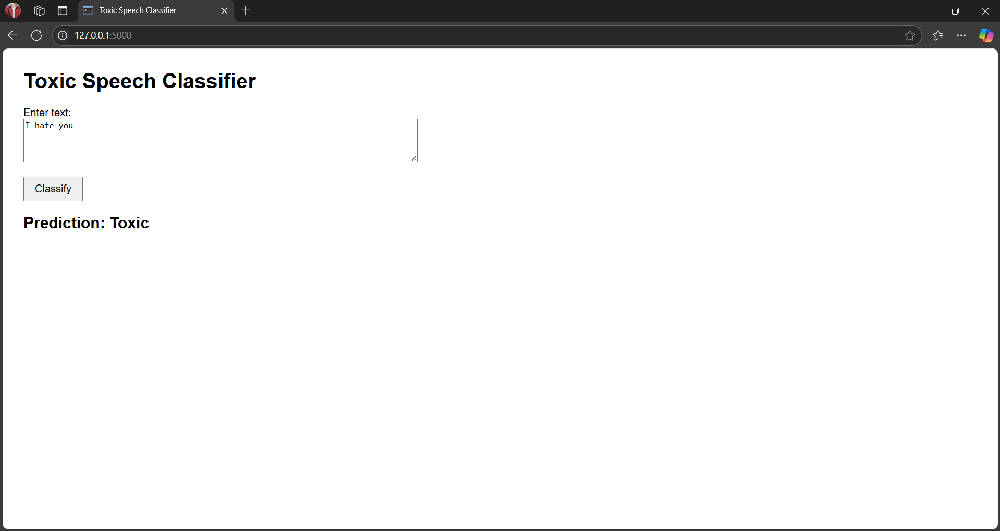

# Task 4: Evaluation and Analysis

In this task, we evaluate the models trained using Odd Layers, Even Layers, and LoRA on the test set. The goal is to compare their performance and analyze the effectiveness of each method.

## Model Types

### Odd Layer Model

* **Description:** This model was trained using the odd layers (1, 3, 5, 7, 9, 11) of the 12-layer BERT teacher model.
* **Objective:** Explore how much the student model's performance benefits from only the odd layers being distilled from the teacher model.

### Even Layer Model

* **Description:** This model was trained using the even layers (2, 4, 6, 8, 10, 12) of the 12-layer BERT teacher model.
* **Objective:** Investigate whether the student model performs better when only the even layers are transferred.

### LoRA Model

* **Description:** LoRA (Low-Rank Adaptation) is a technique used to fine-tune models by adding low-rank adapters.
* **Advantages:** This approach is known for being efficient in terms of memory and computational resources.
* **Objective:** Evaluate if the LoRA method provides competitive performance while offering computational efficiency.

## Evaluation Process

* **Training Loss:**
    * The training loss is calculated during the training process of each model.
    * Lower training loss typically indicates that the model is fitting the training data well.
* **Test Set Performance:**
    * After training, each model is evaluated on a test set using metrics such as accuracy, F1 score, precision, and recall.
    * These metrics help determine how well each model generalizes to unseen data.

## Expected Outcomes

* **Odd Layer vs. Even Layer Models:**
    * We expect the Odd Layer Model to perform similarly to the Even Layer Model, since both distill information from the same teacher model but use different subsets of layers.
* **LoRA Model:**
    * The LoRA Model might show competitive performance—especially in terms of computational efficiency—as it uses a more parameter-efficient fine-tuning method.

## Challenges Encountered and Improvements

### Challenges

* **Distillation Fine-Tuning (Odd and Even Layers)**
    * **Knowledge Transfer:** Distillation using only a subset of layers may not transfer all the important features from the teacher model. This can lead to a student model that misses out on important lower-level nuances.
    * **Layer Selection:** Choosing whether to distill odd or even layers is critical and may not yield the best results for every use case.
* **LoRA Fine-Tuning**
    * **Overfitting:** Although LoRA reduces the number of parameters to be fine-tuned, the added adapters may still overfit the training data if not properly regularized.
    * **Integration:** Ensuring that the low-rank adapters integrate well into the model without significantly changing its performance can be challenging.

### Comparison: Distillation vs. LoRA

* **Distillation:**
    * Training a student model with only specific layers of a teacher model limits the information available to the student.
    * While it can transfer high-level features, it might miss important low-level details.
* **LoRA:**
    * LoRA offers flexibility and computational efficiency by fine-tuning with a limited number of additional parameters.
    * However, it may not capture the deep inter-layer relationships that full model distillation can offer.

### Proposed Improvements

* **Layer Selection for Distillation:**
    * Instead of choosing strictly odd or even layers, a combined or task-specific selection of layers might provide a better balance of information transfer.
* **Regularization for LoRA:**
    * Introducing additional regularization techniques such as weight decay or dropout could help prevent overfitting when using LoRA.
* **Hybrid Approaches:**
    * A hybrid approach that combines the strengths of both distillation and LoRA could be explored. For example, use LoRA for efficient fine-tuning while employing distillation methods to ensure maximum knowledge transfer from the teacher model.

## Visualizations

## Dataset

* Jigsaw Toxic Comment Classification Challenge: [https://www.kaggle.com/c/jigsaw-toxic-comment-classification-challenge/data](https://www.kaggle.com/c/jigsaw-toxic-comment-classification-challenge/data)
